# 6장 다양한 연관관계 매핑

---

## 6.1 다대일
데이터베이스 테이블의 1:N 관계에서 외래 키는 항상 다쪽에 있다.
<br>따라서 객체 양방향 관계에서 연관관계의 주인은 항상 다쪽이다.
<br>예를들어 5장에서 이야기했던 회원(N)과 팀(1)이 있으면 회원이 연관관계 주인이다.

### 6.1.1 다대일 단방향[N:1]

---
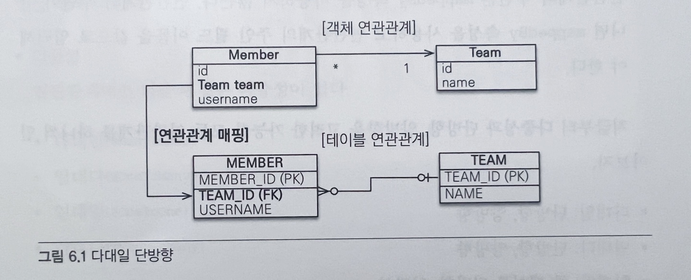

``` java
@Entity
public class Member {
    
    @Id @GeneratedValue
    @Column(name = "MEMBER_ID")
    private Long id;
    
    private String username;
    
    @ManyToOne
    @JoinColumn(name = "TEAM_ID")       
    private Team team;
    
    // Getter, Setter...
}

/** ====================================== */

@Entity
public class Team {
    
    @Id @GeneratedValue
    @Column(name= "TEAM_ID")
    private Long id;
    
    private String name;
    
    // Getter, Setter ...
    
}
```
회원은 Member.team 으로 팀 엔티티를 참조할 수 있지만 반대로 팀에는 회원을 참조하는 필드가 없다.
<br> 따라서 회원과 팀은 다대일 단반향 연관관계이다.

```
@JoinColumn(name = "TEAM_ID") 를 사용해서 Member.team 필드를 TEAM_ID 외래 키와 매핑
따라서 Member.team 필드로 회원 테이블의 TEAM_ID 외래키를 관리
```

### 6.1.2 다대일 양방향[N:1, 1:N]
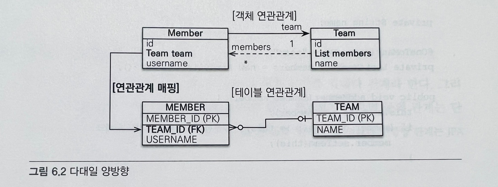
```java
@Entity
public class Member {
    @Id @GenerateValue
    @Column(name = "MEMBER_ID")
    private Long id;
    
    private String username;
    
    @ManyToOne
    @JoinColumn(name = "TEAM_ID")
    private Team team;
    
    public void setTeam(Team team) {
        this.team = team;
        // 무한루프에 빠지지 않도록 체크
        if(!team.getMembers().contains(this)) {
            team.getMembers().add(this);
        }
    }
}

/** ====================================== */

@Entity
public class Team {

    @Id @GeneratedValue
    @Column(name= "TEAM_ID")
    private Long id;

    private String name;

    @OneToMany(mappedBy = "team")
    private List<Member> members = new ArrayList<Member>();
    
    public void addMember(Member member) {
        this.members.add(member);
        if(member.getTeam() != this) {      // 무한루프에 빠지지 않도록 체크
            member.getTeam(this);
        }
    }
    
    // Getter, Setter ...

}
```
#### 🔻 양방향은 외래 키가 있는 쪽이 연관관계 주인
+ 일대다와 다대일 연관관계는 항상 다(N)에 외래 키가 있다. 
<br> 위의 예는 MEMBER 테이블이 외래 키를 가지고 있으므로 Member.team이 연관관계 주인이다.
+ JPA는 외래 키를 관리할때 연관관계의 주인만 사용
+ 주인이 아닌 Team.members는 조회를 위한 JPQL이나 객체 그래프를 탐색할때 사용

#### 🔻 양방향 연관관계는 항상 서로를 참조 
+ 양방향 연관관계는 항상 서로 참조해야 한다.
<br> 어느 한 쪽만 참조하면 양방향 연관관계가 성립하지 않음
<br> 항상 서로 참조하게 하려면 연관관계 편의 메소드를 작성하는것이 좋다. 
--> setTeam(), addMember() 같은 메소드
+ 편의 메소드는 한 곳에만 작성하거나 양쪽 다 작성할 수 있는데, 양쪽에 다 작성하면 무한루프에 빠지므로 주의

## 6.2 일대다
일대다 관계는 다대일 관계의 반대 방향이다.
일대다 관계는 엔티티를 하나 이상 참조할 수 있으므로 자바 컬렉션인 Collection, List, Set, Map 중에 하나를 사용해야 한다.

### 6.2.1 일대다 단방향[1:N]
하나의 팀은 여러 회원을 참조할 수 있는데 이런 관계를 일대다 관계
팀은 회원들은 참조하지만 반대로 회원은 팀을 참조하지 않으면 둘의 관계는 단방향
(일대다 단방향 관계는 JPA 2.0 부터 지원)
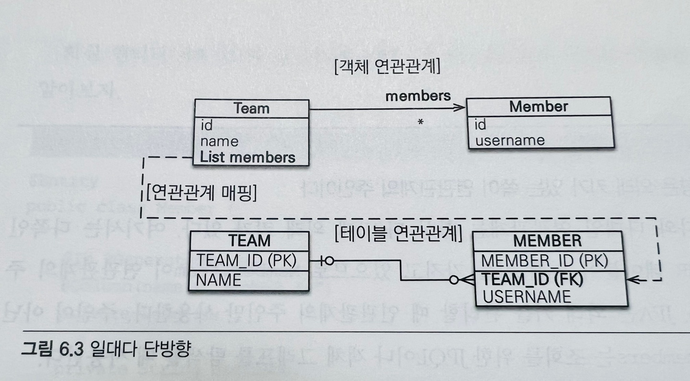
+ 팀 엔티티의 Team.members로 회원 테이블의 TEAM_ID 외래 키를 관리한다.
+ 보통 자신이 매핑한 테이블의 외래 키를 관리하는데 이 매핑은 반대쪽 테이블에 있는 외래 키를 관리
+ 일대다 관계에서 외래 키는 항상 다쪽에 있지만 다쪽인 Member 엔티티에는 외래 키를 매핑할 수 있는 참조 필드가 없고 
<br> 반대쪽인 Team 엔티티에만 참조 필드인 members가 있어 반대편 테이블의 외래 키를 관리

```java
@Entity
public class Team {
    @Id @GeneratedValue
    @Column(name = "TEAM_ID")
    private Long id;
    
    private String name;
    
    @OneToMany
    @JoinColumn(name = "TEAM_ID")       // MEMBER 테이블의 TEAM_ID (FK)
    private List<Member> members = new ArrayList<Member>();
    
    // Getter, Setter..
}

/** ====================================== */

@Entity
public class Member {
    @Id @GeneratedValue
    @Column(name = "MEMBER_ID")
    private Long id;
    
    private String username;
    
    // Getter, Setter ...
}
```
+ 일대다 단방향 관계를 매핑할 때 @JoinColumn을 명시해야 한다.
<br> 그렇지 않으면 JPA는 연결 테이블을 중간에 두고 연관관계를 관리하는 조인 테이블 전략을 기본으로 사용해서 매핑

#### 🔻 일대다 단방향 매핑의 단점
+ 매핑한 객체가 관리하는 외래 키가 다른 테이블에 있다는 점
<br> 본인 테이블에 외래 키가 있으면 엔티티의 저장과 연관관계 처리를 Insert SQL 한번으로 끝낼 수 있지만,
다른 테이블에 외래 키가 있으면 연관관계 처리를 위한 Update SQL을 추가로 실행해야 한다.

```java
public void testSave() {
    
    Member member1 = new Member("member1");
    Member member2 = new Member("member2");
    
    Team team1 = new Team("team1");
    team1.getMembers().add(member1);
    team1.getMembers().add(member2);
    
    em.persist(member1);    // Insert member1
    em.persist(member2);    // Insert member2
    em.persist(team1);      // Insert team, update member1.fk, update member2.fk
        
    transaction.commit();
}
```
+ Member 엔티티는 Team 엔티티를 모른다. 
<br> 그리고 연관관계에 대한 정보는 Team 엔티티의 members가 관리한다.
+ Member 엔티티를 저장할 때는 MEMBER 테이블의 TEAM_ID 외래 키에 아무 값도 저장되지 않음
+ Team 엔티티를 저장할 때 Team.members의 참조 값을 확인해서 회원 테이블에 있는 TEAM_ID 외래 키를 업데이트 한다.

#### 🔻 일대다 단방향 매핑보다는 다대일 양방향 매핑을 사용
일대다 단방향 매핑을 사용하면 다른 테이블에서 외래 키를 관리해야 한다.
<br> 이것은 성능 문제도 있지만 관리도 부담스럽다.
<br> 이문제를 해결하는 좋은 방법은 다대일 양방향 매핑을 사용
<br> 다대일 양방향은 본인 테이블에 외래 키가 있어 단방향 매핑 문제가 발생하지 않는다.

### 6.2.2 일대다 양방향[1:N, N:1]
일대다 양방향 매핑은 존재하지 않으며 대신 다대일 양방향 매핑을 사용
(일대다 양방향과 다대일 양방향은 사실 똑같은 말이다.)
+ 양방향 매핑에서 @OneToMany는 연관관계 주인이 될 수 없다.
+ 관계형 데이터베이스의 특성상 일대다, 다대일 관계는 항상 다 쪽에 외래 키가 있다.
+ 따라서 @OneToMany, @ManyToOne 둘 중에 연관관계의 주인은 항상 다 쪽인 @ManyToOne을 사용하는 곳이다.
+ 일대다 단방향 매핑이 완전히 불가능한 것이 아니며 일대다 단방향 매핑 반대편에 같은 외래 키를 사용하는 다대일 단방향 매핑을 읽기 전용으로 하나 추가하면 된다.

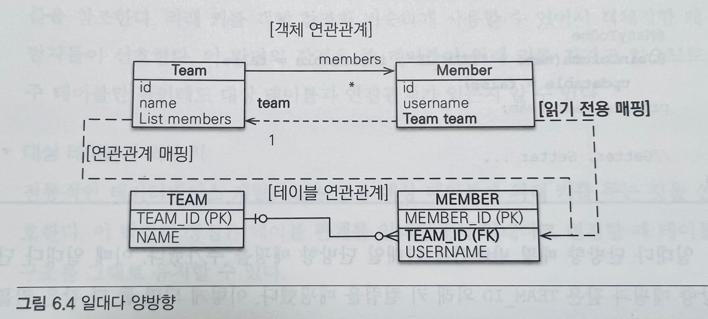

```java
@Entity
public class Team {
    @Id @GeneratedValue
    @Column(name = "TEAM_ID")
    private Long id;
    
    private String name;
    
    @OneToMay
    @JoinColumn(name = "TEAM_ID")
    private List<Member> members = new ArrayList<Member>();
    
    //Getter, Setter...
}

/** ====================================== */

@Entity
public class Member {
    @Id @GeneratedValue
    @Column(name = "MEMBER_ID")
    private Long id;
    private String username;
    
    @ManyToOne
    @JoinColumn(name = "TEAM_ID", insertable = false, updatable = false)
    private Team team;
    
    // Getter, Setter ...
}
```
일대다 단방향 매핑 반대편에 다대일 단방향 매핑을 추가함
<br> 이때 일대다 단방향 매핑과 같은 TEAM_ID 외래 키 컬럼을 매핑함
이렇게 하면 문제가 발생할 수 있다... --> 무슨 문제...???
+ 반대편인 다대일 쪽은 insertable = false, updatable = false로 설정해서 읽기만 가능
+ 이 방법은 일대다 양방향 매핑보다는 일대다 단방향 매핑 반대편에 다대일 단방향 읽기 전용으로 추가해서 
일대다 양방향처럼 보이도록 하는 방법
+ 일대다 단방향 매핑이 가지는 단점을 그대로 가져 가능하면 다대일 양방향 매핑을 사용

## 6.3 일대일 [1:1]
일대일 관계는 양쪽이 서로 하나의 관계만 가진다.
+ 회원은 하나의 사물함만 사용
+ 사물함도 하나의 회원에 의해서만 사용

#### 일대일 관계 특징 
+ 일대일 관계는 그 반대도 일대일 관계
+ 테이블 관계에서 일대다, 다대일은 항상 다(N)쪽이 외래 키를 가진다. 반면에 일대일 관계는 주 테이블이나 대상 테이블 둘 중 어느 곳이나 외래 키를 가질 수 있다.
+ 테이블은 주 테이블이든 대상 테이블이든 외래 키 하나만 있으면 양쪽으로 조회 할 수 있다.

#### 🔻 주 테아블에 외래 키
+ 주 테이블에 외래 키를 두고 대상 테이블을 참조
+ 외래 키를 객체 참조와 비슷하게 사용할 수 있어 객체지향 개발자들이 선호
+ 이 방법의 장점은 주 테이블이 외래 키를 가지고 있어 주 테이블만 확인해도 대상 테이블과 연관관계가 있는지 알 수 있다.
#### 🔻 대상 테이블에 외래 키 
+ 전통적인 데이터베이스 개발자들은 보통 대상 테이블에 외래 키를 두는 것을 선호
+ 이 방법의 장점은 테이블 관계를 일대일에서 일대다로 변경할 때 테이블 구조를 그대로 유지할 수 있다.

### 6.3.1 주 테이블에 외래 키 
JPA도 주 테이블에 외래 키가 있으면 좀 더 편리하게 매핑할 수 있다.

#### 단방향
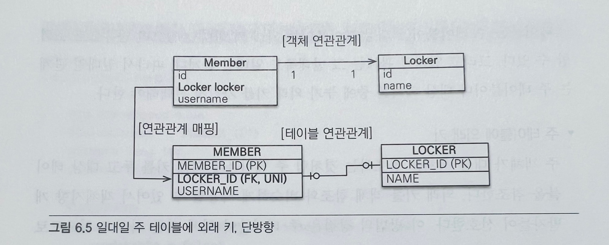
``` java
@Entity
public class Member {
    @Id @GeneratedValue
    @Column(name = "MEMBER_ID")
    private Long id;
    
    private String username;
    
    @OneToOne
    @JoinColumn(name = "LOCKER_ID")
    private Locker locker;
}

/** ====================================== */

@Entity
public class Locker {
    @Id @GeneratedValue
    @Column(name = "LOCKER_ID")
    private Long id;
    
    private String name;
}
```
+ 일대일 관계이므로 객체 매핑에 @OneToOne을 사용했고 데이터베이스에는 LOCKER_ID 외래 키에 유니크 제약 조건(UNI)을 추가함

#### 양방향
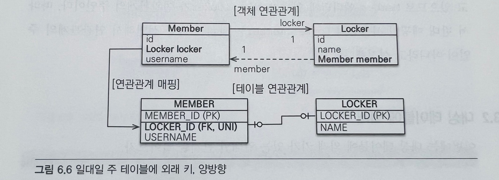
``` java
@Entity
public class Member {
    @Id @GeneratedValue
    @Column(name = "MEMBER_ID")
    private Long id;
    
    private String username;
    
    @OneToOne
    @JoinColumn(name = "LOCKER_ID")
    private Locker locker;
}

/** ====================================== */

@Entity
public class Locker {
    @Id @GeneratedValue
    @Column(name = "LOCKER_ID")
    private Long id;
    
    private String name;
    
    @OneToOne(mappedBy = "locker")
    private Member member;
}
```
+ 양방향이므로 연관관계의 주인을 정해야 한다.
+ MEMBER 테이블이 외래 키를 가지고 있으므로 Member 엔티티에 있는 Member.locker가 연관관계의 주인이다.
+ 반대 매핑인 사물함의 Locker.member는 mappedBy를 선언해서 연관관계의 주인이 아니라고 설정

### 6.3.2 대상 테이블에 외래 키

#### 단방향
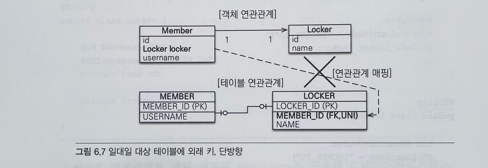
+ 일대일 관계중 대상 테이블에 외래 키가 있는 단방향 관계는 JPA에서 지원하지 않으며 그림과 같이 매핑할 수 있는 방법도 없다.
+ 단방향 관계를 Locker에서 Member 방향으로 수정하거나, 양방향 관계로 만들고 Locker를 연관관계의 주인으로 설정해야 함

#### 양방향
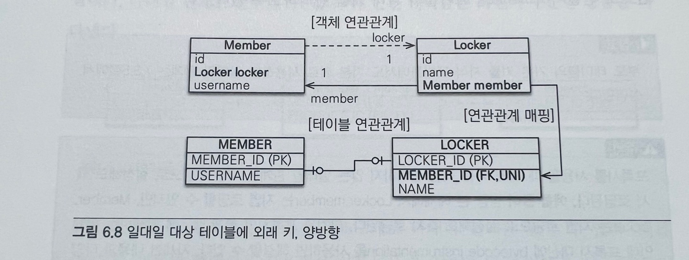
```java
@Entity
public class Member {
    @Id @GeneratedValue
    @Column(name = "MEMBER_ID")
    private Long id;
    
    private String username;
    
    @OneToOne(mappedBy = "member")
    private Locker locker;
}

/** ====================================== */

@Entity
public class Locker {
    @Id @GeneratedValue
    @Column(name = "LOCKER_ID")
    private Long id;
    
    private String name;
    
    @OneToOne
    @JoinColumn(name = "MEMBER_ID")
    private Member member;
}
```
+ 주 엔티티인 Member 엔티티 대신에 대상 엔티티인 Locker를 연관관계의 주인으로 만들어서 LOCKER 테이블의 외래 키를 관리하도록 함
```
프록시를 사용할 때 외래 키를 직접 관리하지 않는 일대일 관계는 지연 로딩으로 설정해도 즉시 로딩됨
방금 예제에서 Locker.member는 지연 로딩할 수 있지만, Member.locker는 지연 로딩으로 설정해도 즉시 로딩됨
이것은 프록시의 한계 때문에 발생하는 문제인데 프록시 대신에 bytecode instrumentaion을 사용하면 해결함
```
## 6.4 다대다 [N:N]
관계형 데이터베이스는 정규화된 테이블 2개로 다대다 관계를 표현할 수 없다.
그래서 다대다 관계를 일대다, 다대일 관계로 풀어내는 연결 테이블을 사용한다.
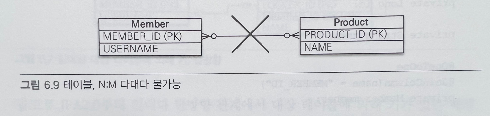
위 그림을 보면 회원 테이블과 상품 테이블은 다대다 관계이다.
+ 회원들은 상품을 주문한다.
+ 상품들은 회원들에 의해 주문된다.
<br> 회원 테이블과 주문 테이블만으로 관계를 표현을 할 수가 없어 아래 그림과 같이 연결 테이블 추가

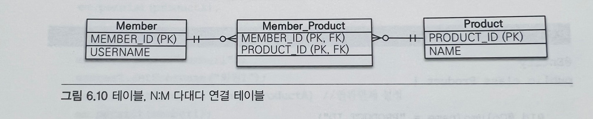
그런데 객체는 테이블과 다르게 객체 2개로 다대다 관계를 만들 수 있음
+ 회원 객체는 컬렉션을 사용해서 상품들을 참조
+ 반대로 상품들도 컬렉션을 사용해서 회원들을 참조

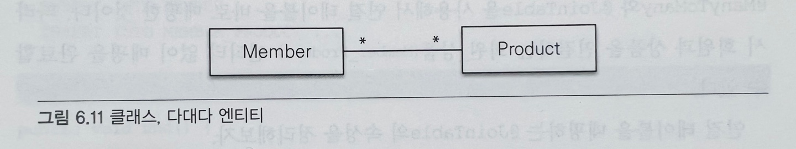

### 6.4.1 다대다: 단방향
```java
@Entity
public class Member {
    @Id @Column(name = "MEMBER_ID")
    private String id;
    
    private String username;
    
    @ManyToMany
    @JoinTable(name = "MEMBER_PRODUCT", joinColumns = @JoinColumn(name = "MEMBER_ID"),
    inverseJoinColumns = @JoinColumn(name = "PRODUCT_ID"))
    private List<Product> products = new ArrayList<Product>();
    
}

/** ====================================== */

@Entity
public class Product {
    @Id @Column(name = "PRODUCT_ID")
    private String id;
    
    private String name;
}
```
+ @ManyToMany 와 @JoinTable을 사용해서 연결 테이블을 바로 매핑
<br>따라서 회원과 상품을 연결하는 회원_상품(Member_product) 엔티티 없이 매핑을 완료할 수 있다.

| 명칭                            | 설명                                      |
|-------------------------------|-----------------------------------------|
| @JoinTable.name               | 연결 테이블을 지정 여기서 MEMBER_PRODUCT 테이블을 선택함  |
| @JoinTable.joinColumns        | 현재 방향인 회원과 매핑할 조인 컬럼 정보를 지정함, MEMBER_ID |
| @JoinTable.inverseJoinColumns | 반대 방향인 상품과 매핑할 조인 컬럼 정보를 지정, PRODUCT_ID |

+ MEMBER_PRODUCT 테이블은 다대다 관계를 일대다, 다대일 관계로 풀어내기 위해 필요한 연결 테이블
+ @ManyToMany로 매핑한 덕분에 다대다 관계를 사용할 때 연결 테이블을 신경 쓰지 않아도 됨

#### 등록
``` java
public void save() {
    
    Product productA = new Product();
    productA.setId("productA");
    productA.setName("상품A");
    em.persist(productA);
    
    Member member1 = new Member();
    member1.setId("member1");
    member1.setUsername("회원1");
    member1.getProducts().add(productA)     // 연관관계 설정
    em.persist(member1);
}
```
회원1과 상품A의 연관관계를 설정했으므로 회원1을 저장할때 연결 테이블에도 값이 저장된다.
```
INSERT INTO PRODUCT ...
INSERT INTO MEMBER ...
INSERT INTO MEMBER_PRODUCT ...
```

#### 조회
``` java
public void find() {
    
    Member member = em.find(Member.class, "member");
    List<Product> products = member.getProducts(); // 객체 그래프 탐색
    for (Product product : products) {
        System.out.println("product.name = " + product.getName());
    }
}
```
+ member.getProducts()를 호출해서 상품 이름을 출력하면 다음 SQL이 실행됨
```
SELECT * FROM MEMBER_PRODUCT MP
INNER JOIN PRODUCT P ON MP.PRODUCCT_ID = P.PRODUCT_ID
WHERE MP.MEMBER_ID = ?
```
+ 연결 테이블인 MEMBER_PRODUCT 와 상품 테이블을 조인해서 연관된 상품을 조회
+ @ManyToMany 덕분에 복잡한 다대다 관계를 애플리케이션에서는 아주 단순하게 사용할 수 있음

### 6.4.2 다대다: 양방향
+ 다대다 매핑이므로 역방향도 @ManyToMany를 사용
+ 양쪽 중 원하는 곳에 mappedBy로 연관관계의 주인을 지정(mappedBy 가 없는 곳이 연관관계 주인)
```java
@Entity
public class Product {
    
    @Id
    private String id;
    
    @ManyToMany(mappedBy = "products")  // 역방향 추가
    private List<Member> members;
}
```
```
member.getProducts().add(product);
product.getMembers().add(member);
```
양방향 연관관계는 연관관계 편의 메소드를 추가해서 관리하는 것이 편리

```java
public void addProduct(Product product) {
    products.add(product);
    product.getMembers().add(this);
}
```
```
member.addProduct(product);
```
+ 연관관계 편의 메소드를 추가했으므로 간단히 양방향 연관관계를 설정하면 된다.

``` java
public void findInverse() {
    Product product = em.find(Product.class, "productA");
    List<Member> members = product.getMembers();
    for (Member member : members) {
        System.out.println("member = " + member.getUsername());
    }
}
```
+ 역방향으로 객체 그래프 탐색

### 6.4.3 다대다: 매핑의 한계와 극복, 연결 엔티티 사용
+ @ManyToMany를 사용하면 연결 테이블을 자동으로 처리해주므로 도메인 모델이 단순해지고 편리해진다.
+ 다대다 매핑을 실무에서 사용하기에는 한계가 있다.

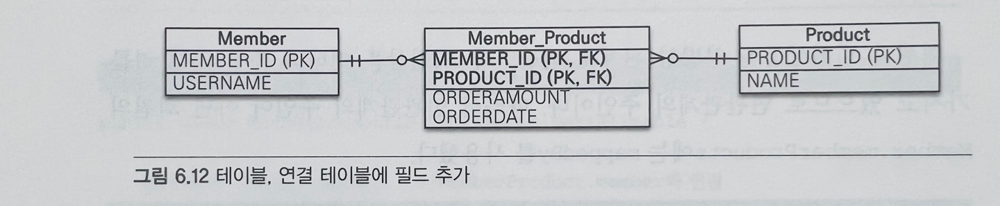
회원이 상품을 주문하면 연결 테이블에 단순히 주문한 회원 아이디와 상품 아이디만 담고 끝나지 않는다.
<br> 보통은 연결 테이블에 주문 수량 컬럼이나 주문한 날짜 같은 컬럼이 더 필요하다.

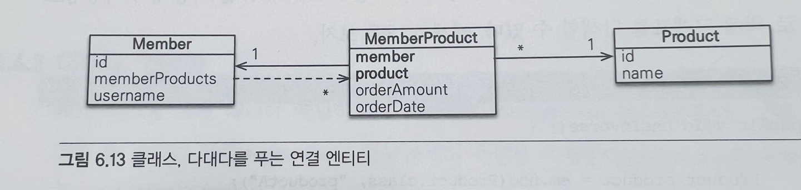
위의 그림처럼 연결 엔티티를 만들고 이곳에 추가한 컬럼들을 매핑해야 한다.
<br> 엔티티 간의 관계도 테이블 관계처럼 다대다에서 일대다, 다대일 관계로 풀어야 한다.
<br> 여기서는 회원사품(MemberProduct) 엔티티를 추가했다.

```java
@Entity
public class Member {
    @Id @Column(name = "MEMBER_ID")
    private String id;
    
    // 역방향
    @OneToMany(mappedBy = "member")
    private List<MemberProduct> memberProducts;
}
```
+ 회원과 회원상품을 양방향 관계로 만들었다.
+ 회원상품 엔티티 쪽이 외래 키를 가지고 있으므로 연관관계의 주인이다.
+ 연관관계 주인이 아닌 회원의 Member.memberProducts에는 mappedBy를 사용했다.

```java
@Entity
public class Product {
    @Id @Column(name = "PRODUCT_ID")
    private String id;
    
    private String name;
}
```
+ 여기서 상품 코드 엔티티에서 회원상품 엔티티로 객체 그래프 탐색 기능이 필요하지 않다고 판단해서 연관관계를 만들지 않았다.

``` java
// 회원상품 엔티티 코드 
@Entity
@IdClass(MemberProductId.class)
public class MemberProduct {
    @Id
    @ManyToOne
    @JoinColumn(name = "MEMBER_ID")
    private Member member;          // MemberProductId.member 와 연결
    
    @Id
    @ManyToOne
    @JoinColumn(name = "PRODUCT_ID")
    private Product product;        // MemberProductId.product와 연결
    
    private int orderAmount;
}
```
```java
// 회원상품 식별자 클래스
public class MemberProductId implements Serializable {
    
    private String member;          // MemberProduct.member와 연결
    private String product;         // MemberProduct.product와 연결
    
    // hashCode and equals
    
    @Override
    public boolean equals(Object o) {}
    
    @Override
    public int hashCode(){}
}
```
회원상품(MemberProduct) 엔티티를 보면 기본 키를 매핑하는 @Id 와 외래키를 매핑하는 @JoinColumn을 동시에 사용해서 기본키 + 외래키를 한번에 매핑했다.
<br>@IdClass를 사용해서 복합 기본 키를 매핑했다.

#### 🔻 복합 기본 키
회원상품 엔티티는 기본 키가 MEMBER_ID와 PRODUCT_ID로 이루어진 복합 기본키다.
<br> JPA에서 복합 키를 사용하려면 별도의 식별자 클래스를 만들어야 한다.
<br> 엔티티에 @IdClass를 사용해서 식별자 클래스를 지정하면 된다. 
<br> 복합 키를 위한 식별자 클래스는 다음과 같은 특징이 있다.
+ 복합 키는 별도의 식별자 클래스로 만들어야 한다.
+ Serializable을 구현해야 한다.
+ equals와 hashCode 메소드를 구현해야 한다.
+ 식별자 클래스는 public 이어야 한다.
+ @IdClass를 사용하는 방법 외에 @EmbeddedId를 사용하는 방법도 있다.

#### 🔻 식별 관계
회원상품은 회원과 상품의 키본 키를 받아서 자신의 기본 키로 사용한다.
<br> 이렇게 부모 테이블의 기본 키를 받아서 자신의 기본 키 + 외래 키로 사용하는 것을 데이터베이스 용어로 `식별관계`라 한다.

#### 정리
```
회원상품(MemberProduct)은 회원의 기본 키를 받아서 자신의 기본 키로 사용함과 동시에 회원과의 관계를 위한 외래 키로 사용한다.
그리고 상품의 기본 키도 받아서 자신의 기본 키로 사용함과 동시에 상품과의 관계를 위한 외래 키로 사용한다.
또한 MemberProductId 식별자 클래스로 두 기본 키를 묶어서 복합 기본 키로 사용한다.
```

``` java
public void save() {
    
    // 회원저장
    Member member1 = new Member();
    member1.setId("member1");
    member1.setUsername("회원1");
    em.persist(member1);
    
    // 상품저장
    Product productA = new Product();
    productA.setId("productA");
    productA.setName("상품1");
    em.persist(productA);
    
    // 회원상품 저장
    MemberProduct memberProduct = new MemberProduct();
    memberProduct.setMember(member1);       // 주문 회원 - 연관관계 설정
    memberProduct.setProduct(productA);     // 주문 상품 - 연관관계 설정
    memberProduct.setOrderAmount(2);        // 주문수량
    
    em.persist(memberProduct);
}
```
회원상품 엔티티를 만들면서 연관된 회원 엔티티와 상품 엔티티를 설정했다.
<br> 회원상품 엔티티는 데이터베이스에 저장될 때 연관된 회원의 식별자와 상품의 식별자를 가져와 자신의 기본 키 값으로 사용한다.

``` java
public void find() {
    
    // 기본 키 값 생성
    MemberProductId memberProductId = new MemberProductId();
    memberProductId.setMember("member1");
    memberProductId.setProduct("productA");
    
    MemberProduct memberProduct = em.find(MemberProduct.class, memberProductId);
    
    Member member = memberProduct.getMember();
    Product product = memberProduct.getProduct();
    
    System.out.println("member = " + member.getUsername());
    System.out.println("product = " + product.getName());
    System.out.println("orderAmount = " + memberProduct.getOrderAmount());
}
```

복합 키는 항상 식별자 클래스를 만들어야 한다. em.find()를 보면 생성한 식별자 클래스로 엔티티를 조회한다.

### 6.4.4 다대다: 새로운 키본 키 사용
책에서 추천하는 기본 키 생성 전략은 데이터베이스에서 자동으로 생성해주는 대리 키 Long 값으로 사용하는 것이다.
<br> 이것의 장점은 간편하고 거의 영구적으로 쓸 수 있으며 비즈니스에 의존하지 않는다.
<br> ORM 매핑 시에 복합 키를 만들지 않아도 되므로 간단히 매핑을 완성할 수 있다.

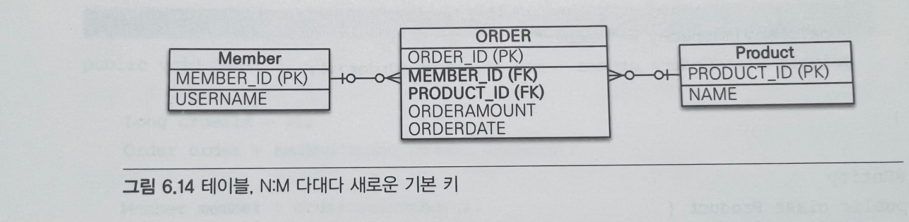
위의 그림은 연결 테이블에 새로운 기본 키를 사용한 방식
<br> ORDER_ID라는 새로운 기본 키를 하나 만들고 MEMBER_ID, PRODUCT_ID 컬럼은 외래 키로만 사용한다.

```java
@Entity
public class Order {
    @Id @GeneratedValue
    @Column(name = "ORDER_ID")
    private Long id;
    
    @ManyToOnew
    @JoinColumn(name = "MEMBER_ID")
    private Member member;
    
    @ManyToOne
    @JoinColumn(name = "PRODUCT_ID")
    private Product product;
    
    private int orderAmount;
}
```
대리 키를 사용함으로써 이전에 보았던 식별 관계에 복합 키를 사용한 것보다 매핑이 단순하고 이해하기 쉽다.

``` java
@Entity
public class Member {
    @Id @Column(name = "MEMBER_ID")
    private String id;
    private String username;
    
    @OneToMany(mappedBy = "member")
    private List<Order> orders = new ArrayList<Order>();
}

@Entity
public class Product {
    @Id @Column(name = "PRODUCT_ID")
    private String id;
    private String name;
}
```

``` java
public void save() {
    // 회원 저장
    Member member1 = new Member();
    member1.setId("member1");
    member1.setUsername("회원1");
    em.persist(member1);
    
    // 상품 저장
    Product productA = new Product();
    productA.setId("productA");
    productA.setName("상품1");
    em.persist(productA);
    
    // 주문 저장
    Order order = new Order();
    order.setMember(member1);       // 주문회원 - 연관관계 설정
    order.setProduct(productA);     // 주문상품 - 연관관계 설정
    order.setOrderAmount(2);        // 주문수량
    em.persist(order);
}
```

``` java
public void find() {
    
    Long orderId = 1L;
    Order order = em.find(Order.class, orderId);
    
    Member member = order.getMember();
    Product product = order.getProduct();
    
    System.out.println("member = " + member.getUsername());
    System.out.println("product = " + product.getName());
    System.out.println("orderAmount = " + order.getOrderAmount());
}
```
식별자 클래스를 사용하지 않아서 코드가 한결 단순해졌다.

### 6.4.5 다대다 연관관계 정리
다대다 관계를 일대다 다대일 관계로 풀어내기 위해 연결 테이블을 만들 때 식별자를 어떻게 구성할지 선택해야 한다.
+ 식별 관계: 받아온 식별자를 기본 키 + 외래 키로 사용한다.
+ 비식별 관계: 받아온 식별자는 외래 키로만 사용하고 새로운 식별자로 추가한다.

데이터베이스 설계에서는 1번처럼 부모 테이블의 기본 키를 받아서 자식 테이블의 기본키 + 외래 키로 사용하는 것을 식별 관계라고 한다.
<br> 2번처럼 단순히 외래 키로만 사용하는 것을 비식별 관계라고 한다.
<br> 객체 입장에서 보면 2번처럼 비식별 관계를 사용하는 것이 복합 키를 위한 식별자 클래스를 만들지 않아도 되므로 단순하고 편리하게 ORM 매핑 할 수 있다.
