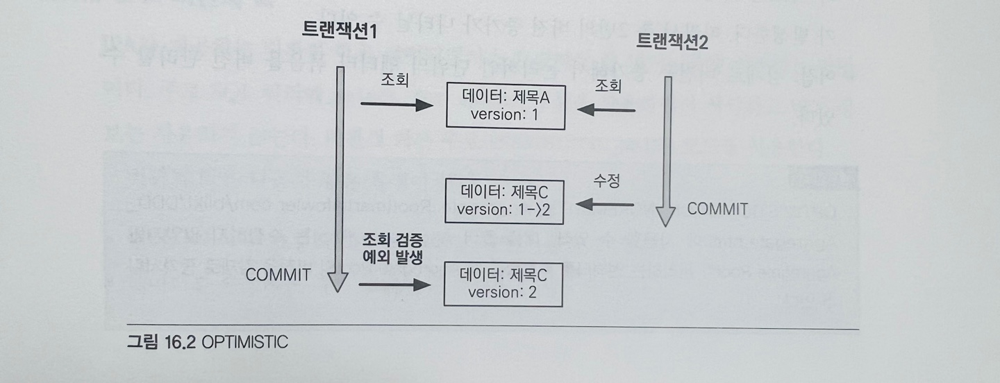
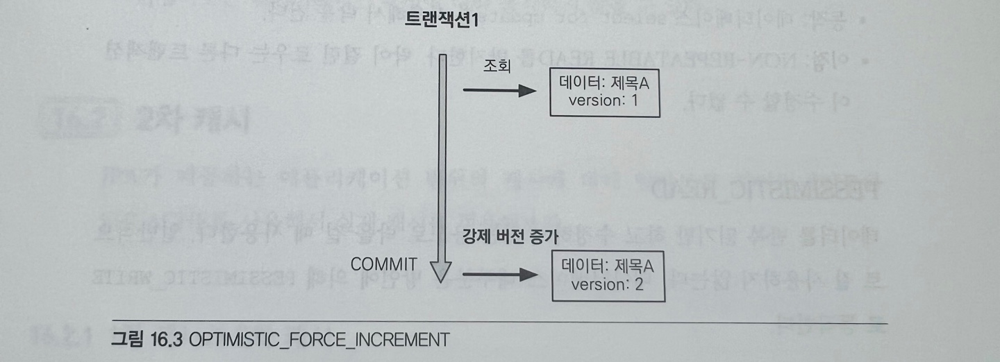
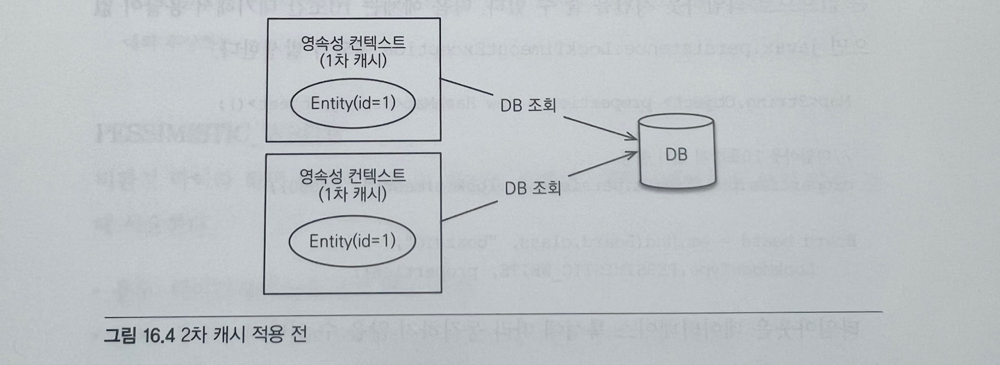
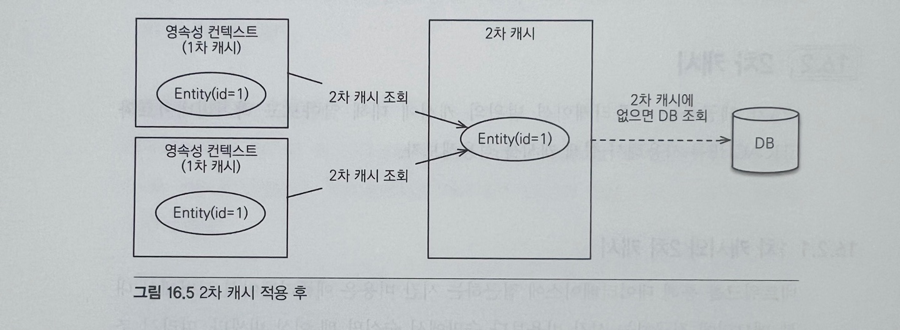
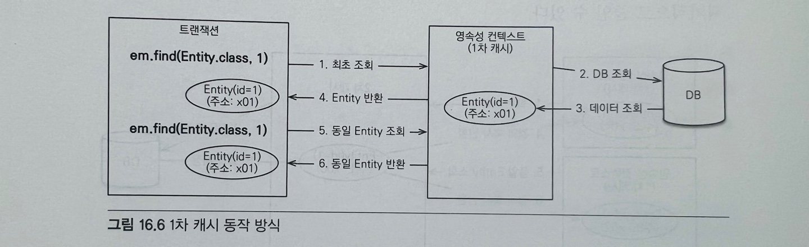
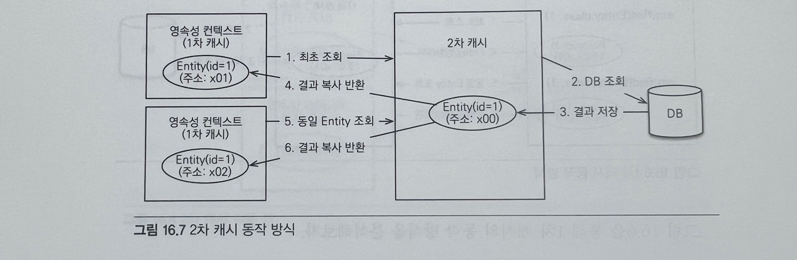

# 트랜잭션과 락, 2차 캐시

## 트랜잭션과 락

### 16.1.1 트랜잭션과 격리 수준
트랜잭션은 ACID라 하는 원자성, 일관성, 격리성, 지속성을 보장해야 한다.

* 원자성: 트랜잭션 내에서 실행한 작업들은 마치 하나의 작업인 것처럼 모두 성공하던가 실패해야 한다. <br>
ex) 계좌이체를 한다고 했을때 입금자가 성공하고 수신자 계좌에는 실패해서는 안된다. 이렇게 되면 입금자에 계좌에 돈만 사라지게 돼서 
큰 문제가 발생하게 된다. 따라서 하나의 트랜잭션 안에 작업들은 모두 성공하거나 실패해야 한다.

* 일관성 : 모든 트랜잭션은 일관성 있는 데이터베이스 상태를 유지해야 한다. <br>
ex) 데이터베이스에서 정한 무결성 제약 조건을 항상 만족해야 한다.

* 격리성 : 동시에 실행되는 트랜잭션들이 서로에게 영향을 미치지 않도록 격리한다. <br>
동시에 같은 데이터를 수정하지 못하도록 해야 한다. <br>
격리성은 동시성과 관련된 성능 이슈로 인해 격리 수준을 선택이 가능하다.

* 지속성: 트랜잭션을 성공적으로 끝내면 그 결과가 항상 기록(반영)되어야 한다. <br>
중간에 시스템에 문제가 발생해도 데이터베이스 로그 등을 사용해서 시스템 발생 전 상태로 되돌릴 수 있다. 

트랜잭션은 원자성, 일관성, 지속성을 보장한다. <br>
격리성을 완벽히 보장하려면 트랜잭션을 거의 차례대로 실행해야 한다. 이렇게 하면 동시성 처리 성능이 매우 나빠진다. <br>
이런 문제로 인해 트랜잭션의 격리 수준을 4단계로 나뉘어 정의했다.

* READ UNCOMMITED (커밋되지 않은 읽기)
* READ COMMITTED(커밋된 읽기)
* REPEATABLE READ(반복 가능한 읽기)
* SERIALIZABLE(직렬화 기능)

```
READ UNCOMMITED < READ COMMITTED < REPEATABLE READ < SERIALIZABLE 
동시성 🔺                                                   동시성 🔻 
격리성 🔻                                                   격리성 🔺
```

<table>
<tr>
    <th>격리수준</th>
    <th>DIRTY READ</th>
    <th>NON-REPEATABLE READ</th>
    <th>PHANTOM READ</th>
</tr>
<tr>
    <td>READ UNCOMMITED</td>
    <td>O</td>
    <td>O</td>
    <td>O</td>
</tr>
<tr>
    <td>READ COMMITED</td>
    <td></td>
    <td>O</td>
    <td>O</td>
</tr>
<tr>
    <td>REPEATABLE READ</td>
    <td></td>
    <td></td>
    <td>O</td>
</tr>
<tr>
    <td>SERIALIZABLE</td>
    <td></td>
    <td></td>
    <td></td>
</tr>
</table> 

```표 트랜잭션 격리 수준과 문제점 ```

격리 수준에 따른 문제점은 다음과 같다.
* DIRTY READ
* NON-REPEATABLE READ(반복 불가능한 읽기)
* PHANTOM READ

격리 수준이 낮을수록 더 많은 문제를 발생한다.

#### READ UNCOMMITED 
커밋하지 않은 데이터를 읽을 수 있다. <br>
ex) 트랜잭션 1이 회원테이블에 A의 나이를 20살에서 21살로 update 작업을 수행하고 커밋하지 않아도 
트랜잭션 2가 A의 나이를 조회할 경우 21살로 조회가 된다. 이러한 문제를 ```DIRTY READ```라고 한다. <br>
만약 트랜잭션 1이 문제가 발생해 롤백하게 되면 A의 나이는 20살로 변경되고 트랜잭션 2는 계속 21살로 인지하고 있다. <br>
이렇게 되면 데이터 정합성 문제가 심각하게 발생한다. 

#### READ COMMITTED 
커밋한 데이터만 읽을 수 있다. <br>
커밋한 데이터만 읽을 수 있기 때문에 DIRTY READ가 발생하지 않지만 NON-REPEATABLE READ는 발생할 수 있다. <br>
ex) 트랜잭션 1이 A의 나이를 조회하면 20살이 조회중에 트랜잭션 2가 A의 나이를 21살로 변경하고 커밋을 하게되면
트랜잭션 1이 A의 나이를 다시 조회하면 수정된 나이 21살이 조회된다. <br>
이처럼 반복해서 같은 데이터를 읽을 수 없는 상태를 NON-REPEATABLE READ 라고 한다. 

#### REPEATABLE READ
한 번 조회한 데이터를 반복해서 조회해도 같은 데이터가 조회된다. 하지만 PHANTOM READ는 발생할 수 있다. <br>


#### SERIALIZABLE
가장 엄격한 트랜잭션 격리 수준이다. <br>
격리수준이 SERIALIZABLE일 경우 읽기 작업에도 ```공유 잠금```을 설정하게 되고, 이러면 동시에 다른 트랜잭션에서 해당 레코드를
변경하지 못하게 되기때문에 동시성 처리 성능이 급격히 떨어진다.


### 16.1.2 낙관적 락과 비관적 락 기초

JPA의 영속성 컨텍스트(1차캐시)를 적절히 활용하면 데이터베이스 트랜잭션이 READ COMMITED 격리 수준이어도 애플리케이션 레벨에서
반복 가능한 읽기가 가능하기 때문에 트랜잭션 격리 수준을 READ COMMITED 정도로 가정한다. <br>
만약 일부 로직에 더 높은 격리 수준이 필요하면 낙관적 락과 비관적 락 중 하나를 사용해야 한다.

##### 낙관적 락
트랜잭션 대부분 충돌이 발생하지 않는다고 낙관적으로 가정하는 방법이다. <br>
데이터베이스가 제공하는 락 기능을 사용하는 것이 아니라 JPA가 제공하는 버전 관리 기능을 사용하는 애플리케이션이 제공하는 락이다. <br>
낙관적 락은 트랜잭션을 커밋하기 전까지는 트랜잭션의 충돌을 알 수 없다는 특징이 있다.

##### 비관적 락
트랜잭션의 충돌이 발생한다고 가정하고 우선 락을 걸고 보는 방법이다. <br>
데이터베이스가 제공하는 락 기능을 사용하며 대표적으로 ```select for update``` 구문이 있다. <br>
추가로 데이터베이스 트랜잭션 범위를 넘어서는 문제도 있다. 예를들어 동시에 사용자 A,B가 같은 공지사항을 수정한다고 가정할때
수정 화면에서 수정 후 A가 먼저 완료 버튼을 누르고 잠시 뒤 B가 완료 버튼을 눌렀을때 A가 수정한 수정내역은 없고 B가 수정한
내역이 남게 된다. 이것을 ```두 번의 갱신 분실 문제```라 한다.

이 문제는 트랜잭션 범위를 넘어서기 때문에 트랜잭션만으로 해결을 할 수 없으며 3가지 방법중 하나로 선택해야 한다. 
* 마지막 커밋만 인정하기 : 사용자 A의 내용은 무시하고 마지막에 커밋한 사용자 B의 내용만 인정한다.
* 최초 커밋만 인정하기 : 사용자 A가 이미 수정을 완료했으므로 사용자 B가 수정을 완료할 때 오류가 발생한다.
* 충돌하는 갱신 내용 병합하기 : 사용자 A와 사용자 B의 수정사항을 병합한다.
 
기본은 마지막 커밋만 인정하기가 사용된다. 하지만 상황에 따라 최초 커밋만 인정하기가 더 합리적일 수 있다. <br>
JPA가 제공하는 버전 관리 기능을 사용하면 손쉽게 최초 커밋만 인정하기를 구현이 가능하다.
충돌하는 갱신 내용 병합하기는 최초 커밋만 인정하기를 좀 더 우아하게 처리하는 방법인데 개발자가 직접 사용자를 위해 병합 방법을
제공해야 한다.

### 16.1.3 @Version
JPA가 제공하는 낙관적 락을 사용하려면 @Version 어노테이션을 사용해서 버전 관리 기능을 추가해야 한다.
```java
@Entity
public class Board {
    
    @Id
    private String id;
    private String title;
    
    @Version
    private Integer version;
}
```
버전 관리 기능을 적용하려면 엔티티에 버전 관리용 필드를 하나 추가하고 @Version 어노테이션을 붙이면 된다. <br>
엔티티를 수정할 때 마다 버전이 하나씩 자동으로 증가하고 엔티티를 수정할 때 조회 시점의 버전과 수정 시점의 버전이 다르면 예외가 발생한다.

```
// 트랜잭션 1 조회 title="제목A", version=1
Board board = em.find(Board.class, id);

// 트랜잭션 2에서 해당 게시물을 수정해서 title="제목C", version=2로 증가

board.setTitle("제목B");  // 트랜잭션1 데이터 수정

save(board);
tx.commit();        // 예외 발생, 데이터베이스 version=2, 엔티티 version=1 
```

제목이 A이고 버전이 1인 게시물이 있다.
1. 트랜잭션 1은 제목 B로 변경하려고 조회하려고 한다.
2. 이때 트랜잭션 2가 해당 데이터를 조회해서 제목 C로 수정하고 커밋해서 버전 정보가 2로 증가했다.
3. 이후 트랜잭션 1이 데이터를 제목 B로 변경하고 트랜잭션 커밋하는 순간 엔티티를 조회할 때 버전과 데이터베이스의 현재 버전
정보가 다르므로 예외가 발생한다.
4. 따라서 버전 정보를 사용하면 ```최초 커밋만 인정하기```가 적용된다.

#### 버전 정보 비교 방법
JPA가 버전 정보를 비교하는 방법은 단순하며 엔티티를 수정하고 트랜잭션 커밋하면 영속성 컨텍스트를 플러시 하면서
UPDATE 쿼리를 실행한다.
```
UPDATE BOARD
SET
    TITLE = ?,
    VERSION = ? (버전 + 1 증가)
WHERE
    ID = ?
    AND VERSION = ? (버전 비교)
```
데이터베이스 버전과 엔티티 버전이 같으면 데이터를 수정하면서 동시에 버전도 하나 증가시킨다. <br>
만약 데이터베이스에 버전이 이미 증가해서 수정 중인 엔티티의 버전과 다르면 UPDATE 쿼리의 WHERE 문에서 VERSION 값이 다르므로
수정할 대상이 없다. 이때 버전이 이미 증가한 것으로 판단해서 JPA가 예외를 발생시킨다.
버전은 엔티티의 값을 변경하면 증가한다. 단 연관관계 필드는 외래 키를 관리하는 연간관계의 주인 필드를 수정할 때만 버전이 증가한다.
@Version으로 추가한 버전 관리 필드는 JPA가 직접 관리하므로 개발자가 임의로 수정하면 안된다.(벌크 연산 제외)

### 16.1.4 JPA 락 사용
```
JPA를 사용할 때 추천하는 전략은 READ COMMITED 트랜잭션 격리 수준 + 낙관적 버전 관리(@Version)이다.
```
락 적용
* EntityManager.lock(), EntityManager.find(), EntityManager.refresh()
* Query.setLockMode() (TypeQuery 포함)
* @NamedQuery

<table>
<tr>
    <th>락 모드</th>
    <th>타입</th>
    <th>설명</th>
</tr>
<tr>
    <td>낙관적 락</td>
    <td>OPTIMISTIC</td>
    <td>낙관적 락을 사용한다.</td>
</tr>
<tr>
    <td>낙관적 락</td>
    <td>OPTIMISTIC_FORCE_INCREMENT</td>
    <td>낙관적 락 + 버전정보를 강제로 증가한다.</td>
</tr>
<tr>
    <td>비관적 락</td>
    <td>PESSIMISTIC_READ</td>
    <td>비관적 락, 읽기 락을 사용한다.</td>
</tr>
<tr>
    <td>비관적 락</td>
    <td>PESSIMISTIC_WRITE</td>
    <td>비관적 락, 쓰기 락을 사용한다.</td>
</tr>
<tr>
    <td>비관적 락</td>
    <td>PESSIMISTIC_FORCE_INCREMENT</td>
    <td>비관적 락 + 버전정보를 강제로 증가한다.</td>
</tr>
<tr>
    <td>기타</td>
    <td>NONE</td>
    <td>락을 걸지 않는다.</td>
</tr>
<tr>
    <td>기타</td>
    <td>READ</td>
    <td>JPA 1.0 호환 기능이다. OPTIMISTIC과 같으므로 OPTIMISTIC을 사용하면 된다.</td>
</tr>
<tr>
    <td>기타</td>
    <td>WRITE</td>
    <td>JPA 1.0 호환 기능이다. OPTIMISTIC_FORCE_INCREMENT와 같다.</td>
</tr>
</table>

### 16.1.5 JPA 낙관적 락
JPA가 제공하는 낙관적 락은 버전(@Version)을 사용한다. 따라서 낙관적 락을 사용하려면 버전이 있어야 한다.
<br>낙관적 락은 트랜잭션을 커밋하는 시점에 충돌을 알 수 있다는 특징이 있다.

#### 낙관적 락에서 발생하는 예외
* javax.persistence.OptimisticLockException(JPA 예외)
* org.hibernate.StaleObjectStateException(하이버네이트 예외)
* org.springframework.orm.ObjectOptimisticLockingFailureException(스프링 예외 추상화)

```
참고
일부 JPA 구현체 중에는 @Version 컬럼 없이 낙관적 락을 허용하기도 하지만 추천하지 않는다.
```
락 옵션 없이 @Version만 있어도 낙관적 락이 적용된다. 락 옵션을 사용하면 좀 더 세밀하게 제어가 가능하다.

#### NONE
@Version만 적용했을 때
* 용도 : 조회한 엔티티를 수정할 때 다른 트랜잭션에 의해 변경(삭제)되지 않아야 한다.
조회 시점부터 수정 시점까지 보장
* 동작 : 엔티티를 수정할 때 버전을 체크하면서 버전을 증가한다.(update 쿼리 사용)
이때 버전 값이 현재 버전이 아니면 예외가 발생한다.
* 이점 : 두 번의 갱신 분실 문제를 예방한다.

#### OPTIMISTIC
@Version만 적용했을 때는 엔티티를 수정해야 버전을 체크하지만 이 옵션을 추가하면 엔티티를 조회만 해도 버전을 체크한다.
즉, 조회한 엔티티는 트랜잭션을 종료할 때까지 다른 트랜잭션에서 변경하지 않음을 보장한다.
* 용도 : 조회한 엔티티는 트랜잭션이 끝날 때까지 다른 트랜잭션에 의해 변경되지 않아야 한다. 
조회 시점부터 트랜잭션이 끝날 때까지 조회한 엔티티가 변경되지 않음을 보장한다.
* 동작 : 트랜잭션을 커밋할 때 버전 정보를 조회해서(SELECT 쿼리 사용) 현재 엔티티의 버전과 같은지 검증한다.
같지 않으면 예외가 발생한다.
* 이점 : OPTIMISTIC 옵션은 DIRTY READ 와 NON-REPEATABLE READ를 방지한다.
```
//트랜잭션 1 조회 title="제목A", version=1
Board board = em.find(Board.class, id, LockModeType.OPTIMISTIC);

// 중간에 트랜잭션 2에서 해당 게시물을 수정해서 title="제목C", version=2로 증가

//트랜잭션 1 커밋 시점에 버전 정보 검증, 예외 발생
// (데이터베이스 version=2, 엔티티 version=1)
tx.commit();
```

1. 트랜잭션 1이 OPTIMISTIC 락으로 버전이 1인 데이터를 조회한다.
2. 이후 트랜잭션 2가 데이터를 수정해서 버전 2로 증가했다.
3. 트랜잭션 1은 엔티티를 OPTIMISTIC 락으로 조회했으므로 트랜잭션을 커밋할 때 데이터베이스에 있는 버전 정보를
```SELECT 쿼리로 조회해서 처음에 조회한 엔티티의 버전 정보와 비교한다.``` 이때 버전 정보가 다르면 예외가 발생한다.
락 옵션을 걸지 않고 @Version만 사용하면 엔티티를 수정해야 버전 정보를 확인하지만 OPTIMISTIC 옵션을 사용하면
엔티티를 수정하지 않고 단순히 조회만 해도 버전을 확인한다.

#### OPTIMISTIC_FORCE_INCREMENT
낙관적 락을 사용하면서 버전 정보를 강제로 증가한다.
* 용도 : 논리적인 단위의 엔티티 묶음을 관리할 수 있다.
ex) 게시물과 첨부파일이 일대다, 디대일의 양방향 연관관계이고 첨부파일이 연관관계 주인일 때 게시물을 수정하는 데 단순히 첨부파일만 추가하면
게시물의 버전은 증가하지 않는다. 해당 게시물의 버전도 강제로 증가하려면 OPTIMISTIC_FORCE_INCREMENT를 사용하면 된다. 
* 동작 : 엔티티를 수정하지 않아도 트랜잭션을 커밋할 때 UPDATE 쿼리를 사용해서 버전 정보를 강제로 증가시킨다.
이때 데이터베이스의 버전이 엔티티의 버전과 다르면 예외가 발생한다. 추가로 엔티티를 수정하면 수정 시 버전 UPDATE가 발생한다.
따라서 총 2번의 버전 증가가 나타날 수 있다.
* 이점 : 강제로 버전을 증가해서 논리적인 단위의 엔티티 묶음을 버전 관리할 수 있다.
```
// 트랜잭션 1 조회 title="제목A", version=1
Board board = em.find(Board.class, id, LockModeType.OPTIMISTIC_FORCE_INCREMENT);

// 트랜잭션 1 커밋 시점에 버전 강제 증가
tx.commit();
```

데이터를 수정하지 않아도 트랜잭션을 커밋할 때 버전 정보가 증가한다.

### 16.1.6 JPA 비관적 락
JPA가 제공하는 비관적 락은 데이터베이스 트랜잭션 락 매커니즘에 의존하는 방법이다. <br>
주로 SQL 쿼리에 ```select for update``` 구문을 사용하면서 시작하고 버전 정보는 사용하지 않는다. <br>
비관적 락은 주로 PESSIMISTIC_WRITE 모드를 사용한다.

비관적 락 특징
* 엔티티가 아닌 스칼라 타입을 조회할 때도 사용할 수 있다.
* 데이터를 수정하는 즉시 트랜잭션 충돌을 감지할 수 있다.

비관적 락에서 발생하는 예외는 다음과 같다.
* javax.persistence.PessimisticLockException(JPA 예외)
* org.springframework.dao.PessimisticLockingFailureException(스프링 예외 추상화)

#### PESSIMISTIC_WRITE
비관적 락이라 하면 일반적으로 이 옵션을 뜻한다.
* 용도 : 데이터베이스에 쓰기 락을 건다.
* 동작 : 데이터베이스 ```select for update```를 사용해서 락을 건다.
* 이점 : NON-REPEATABLE READ를 방지한다. 락이 걸린 로우는 다른 트랜잭션이 수정할 수 없다. 

#### PESSIMISTIC_READ
비관적 락중 유일하게 버전 정보를 사용한다. 비관적 락이지만 버전 정보를 강제로 증가시킨다. <br>
하이버네이트는 ```nowait```를 지원하는 데이터베이스에 대해서 ```for update nowait``` 옵션을 적용한다.
* 오라클 : ```for update nowait```
* PostgreSQL : ```for update nowait```
* nowait를 지원하지 않으면 ```for update```가 사용된다.

### 16.1.7 비관적 락과 타임아웃
비관적 락을 사용하면 락을 획득할 때까지 트랜잭션이 대기한다. 무한정 기다릴 수는 없으므로 타임아웃 시간을 줄 수 있다.
```
Map<String,Object> properties = new HashMap<String,Object>();

// 타임아웃 10초까지 대기 설정
properties.put("javax.persistence.lock.timeout", 10000);

Board board = em.find(Board.class, "boardId", LockModeType.PESSIMISTIC_WRITE, properties);
```
10초간 대기해서 응답이 없으면 javax.persistence.LockTimeoutException 예외가 발생한다.

## 2차 캐시

### 16.2.1 1차 캐시와 2차 캐시
네트워크를 통해 데이터베이스를 접근하는 시간 비용은 애플리케이션 서버에서 내부 메모리에 접근하는 시간 비용보다 수만에서 수십만 배 이상
비싸다. 따라서 조회한 데이터를 메모리에 캐시해서 데이터베이스 접근 횟수를 줄이면 애플리케이션 성능을 획기적으로 개선할 수 있다.<br>
영속성 컨텍스트 내부에는 엔티티를 보관하는 저장소를 1차 캐시라고 하는데 일반적인 웹 애플리케이션 환경은 트랜잭션을 시작하고
종료할 때까지만 1차 캐시가 유효하다. OSIV를 사용해도 클라이언트 요청이 들어올 때부터 끝날때 까지만 1차 캐시가 유효하다. <br>
따라서 애플리케이션 데이터베이스 접근 횟수를 획기적으로 줄이지는 못한다. <br>
하이버네이트를 포함한 대부분의 JPA 구현체들은 애플리케이션 범위의 캐시를 지원하는데 이것을 공유 캐시 또는 2차 캐시라 한다.




#### 1차 캐시
1차 캐시는 영속성 컨텍스트 내부에 있다. 엔티티 매니저로 조회하거나 변경하는 모든 엔티티는 1차 캐시에 저장된다. <br>
트랜잭션을 커밋하거나 플러시를 호출하면 1차 캐시에 있는 엔티티의 변경 내역을 데이터베이스에 동기화 한다. <br>
JPA를 J2EE나 스프링 프레임워크 같은 컨테이너 위에서 실행하면 트랜잭션을 시작할 때 영속성 컨텍스트를 생성하고 트랜잭션을
종료할 때 영속성 컨텍스트도 종료한다. OSIV를 사용하면 시작부터 끝까지 같은 영속성 컨텍스트를 유지할 수 있다.


1. 최초 조회할 때는 1차 캐시에 엔티티가 없다
2. 데이터에비스에서 엔티티 조회
3. 1차 캐시에 보관
4. 1차 캐시에 보관한 결과를 반환
5. 이후 같은 엔티티를 조회하면 1차 캐시에 같은 엔티티가 있으므로 데이터베이스에 조회하지 않고 1차 캐시의 엔티티를 그대로 반환

#### 1차 캐시 특징
* 같은 엔티티가 있으면 해당 엔티티를 그대로 반환한다. 1차 캐시는 객체 동일성(a == b)을 보장한다.
* 1차 캐시는 기본적으로 영속성 컨텍스트 범위의 캐시다(컨테이너 환경에서는 트랜잭션 범위의 캐시, OSIV는 요청 범위)

#### 2차 캐시
애플리케이션에서 공유하는 캐시를 JPA는 공유 캐시라 하는데 일반적으로 2차 캐시라 부른다.
2차 캐시는 애플리케이션 범위의 캐시이며 애플리케이션을 종료할 때까지 캐시가 유지된다. <br>
분산 캐시나 클러스터링 환경의 캐시는 애플리케이션보다 더 오래 유지될 수도 있다.
2차 캐시를 적용하면 엔티티 매니저를 통해 데이터를 조회할 때 우선 2차 캐시에서 찾고 없으면 데이터베이스에서 찾는다. <br>
2차 캐시를 적절히 활용하면 데이터베이스 조회 횟수를 획기적으로 줄일 수 있다.

1. 영속성 컨텍스트는 엔티티가 필요하면 2차 캐시를 조회
2. 2차 캐시에 엔티티가 없으면 데이터베이스를 조회
3. 결과를 2차 캐시에 보관
4. 2차 캐시는 자신이 보관하고 있는 엔티티를 복사해서 반환
5. 2차 캐시에 저장되어 있는 엔티티를 조회하면 복사본을 만들어 반환한다.

2차 캐시는 동시성을 극대화하려고 캐시한 객체를 직접 반환하지 않고 복사본을 만들어서 반환한다.
만약 캐시한 객체를 그대로 반환하면 여러 곳에서 같은 객체를 동시에 수정하는 문제가 발생할 수 있다. <br>
이 문제를 해결하려면 객체에 락을 걸어야 하는데 이렇게 하면 동시성이 떨어질 수 있다. <br>
락에 비하면 비용이 저렴하기 때문에 복사본을 반환한다.

#### 2차 캐시 특징
* 2차 캐시는 영속성 유닛 범위의 캐시
* 2차 캐시는 조회한 객체를 그대로 반환하는 것이 아니라 복사본을 만들어서 반환
* 2차 캐시는 데이터베이스 기본 키를 기준으로 캐시하지만 영속성 컨텍스트가 다르면 객체 동일성(a == b)을 보장하지 않는다.


### 16.2.2 JPA 2차 캐시 기능
JPA 2.0 부터 캐시 표준을 정의했다. 이전에는 JPA 구현체가 각자 지원하였다.

#### 캐시 모드 설정
@Cacheable 어노테이션을 사용하면 된다. @Cacheable(true), @Cacheable(false)를 설정할 수 있는데 기본값은 true
```java
@Cacheable
@Entity
public class Member {
    
    @Id @GeneratedValue
    private Long id;
    //...
}
```

```persistence.xml```에 ```shard-cache-mode```를 설정해서 애플리케이션 전체에 캐시를 어떻게 적용할지 옵션을 설정해야 한다.
```
persistence.xml에 캐시 모드 설정

<persistence-unit name="test">
    <shared-cache-mode>ENABLE_SELECTIVE</shared-cache-mode>
</persistence-unit>
```

```
캐시 모드 스프링 프레임워크 XML 설정 

<bean id="entityManagerFactory" class="org.springframework.orm.jpa.LocalContainerEntityManagerFactoryBean">
    <property name="sharedCacheMode" value="ENABLE_SELECTIVE" />
    ...
```

<table>
<tr>
    <th>캐시 모드</th>
    <th>설명</th>
</tr>
<tr>
    <td>ALL</td>
    <td>모든 엔티티를 캐시한다.</td>
</tr>
<tr>
    <td>NONE</td>
    <td>캐시를 사용하지 않는다.</td>
</tr>
<tr>
    <td>ENABLE_SELECTIVE</td>
    <td>Cacheable(true)로 설정된 엔티티만 캐시를 적용한다.</td>
</tr>
<tr>
    <td>DISABLE_SELECTIVE</td>
    <td>모든 엔티티를 캐시하는데 Cacheable(false)로 명시된 엔티티는 캐시하지 않는다.</td>
</tr>
<tr>
    <td>UNSPECIFIED</td>
    <td>JPA 구현체가 정의한 설정을 따른다.</td>
</tr>
</table>

#### 캐시 조회, 저장 방식 설정
캐시를 무시하고 데이터베이스를 직접 조회하거나 캐시를 갱신하려면 캐시 조회 모드와 캐시 보관 모드를 사용하면 된다.<br>
캐시 조회 모드나 보관 모드에 따라 사용할 프로퍼티와 옵션이 다르다.
* javax.persistence.cache.retrieveMode : 캐시 조회 모드 프로퍼티 이름
* javax.persistence.cache.storeMode : 캐시 보관 모드 프로퍼티 이름

옵션 
* javax.persistence.CacheRetrieveMode : 캐시 조회 모드 설정 옵션
* javax.persistence.CacheStoreMode : 캐시 보관 모드 설정 옵션

``` java
// 캐시 조회 모드
public enum CacheRetrieveMode {
    USE,
    BYPASS
}
```
* USE : 캐시에서 조회한다. 기본값
* BYPASS : 캐시를 무시하고 데이터베이스에 직접 접근

``` java
public enum CacheStoreMode {
    USE,
    BYPASS,
    REFRESH
}
```
* USE : 조회한 데이터를 캐시에 저장한다. 조회한 데이터가 이미 캐시에 있으면 캐시 데이터를 최신 상태로 갱신하지 않는다.
트랜잭션을 커밋하면 등록 수정한 엔티티도 캐시에 저장한다. 기본값
* BYPASS : 캐시에 저장하지 않는다.
* REFRESH : USE 전략에 추가로 데이터베이스에서 조회한 엔티티를 최신 상태로 다시 캐시한다.

#### JPA 캐시 관리 API
JPA는 캐시를 관리하기 위한 javax.persistence.Cache 인터페이스를 제공하며, EntityManagerFactory에서 구할 수 있다.
```
Cache cache = emf.getCache();
boolean contains = cache.contains(TestEntity.class, testEntity.getId());
System.out.println("contains = " + contains);
```
```java
public interface Cache {
    // 해당 엔티티가 캐시에 있는지 여부 확인
    public boolean contains(Class cls, Object primaryKey);
    
    // 해당 엔티티중 특정 식별자를 가진 엔티티를 캐시에서 제거
    public void evict(Calss cls, Object primaryKey);
    
    // 해당 엔티티 전체를 캐시에서 제거
    public void evict(Class cls);
    
    // 모든 캐시 데이터 제거
    public void evictAll();
    
    // JPA Cache 구현체 조회
    public <T> T unwrap(Class<T> cls);
}
```

### 16.2.3 하이버네이트와 EHCACHE 적용
하이버네이트와 EHCACHE(ehcache.org)를 사용해서 2차 캐시를 적용 설명<br>
하이버네이트가 지원하는 캐시는 크게 3가지가 있다.

1. 엔티티 캐시 : 엔티티 단위로 캐시한다. 식별자로 엔티티를 조회하거나 컬렉션이 아닌 연관된 엔티티를 로딩할 때 사용
2. 컬렉션 캐시 : 엔티티와 연관된 컬렉션을 캐시한다. 컬렉션이 엔티티를 담고 있으면 식별자 값만 캐시한다.(하이버네이트 가능)
3. 쿼리 캐시 : 쿼리와 파리미터 정보를 키로 사용해서 캐시한다. 결과가 엔티티면 식별자 값만 캐시한다(하이버네이트 기능)

참고로 JPA 표준에는 엔티티 캐시만 정의되어 있다.

#### 환경설정
라이브러리 추가
```
<dependency>
    <groupId>org.hibernate</groupId>
    <artifactId>hibernate-ehcache</artifactId>
    <version>4.3.10.Final</version>
</dependency>
```
```hibernate-ehcache```를 추가하면 ```net.sf.ehcache-core``` 라이브러리 추가된다. 

``` xml
<ehcache>
    <defaultCache
        maxElementsInMemory="10000"
        eternal="false"
        timeToIdleSeconds="1200"
        timeToLiveSeconds="1200"
        diskExpiryThreadIntervalSeconds="1200"
        memoryStoreEvictionPolicy="LRU"
        />
</ehcache>
```
EHCACHE는 ehcache.xml 설정 파일로 사용한다. <br>
이 설정파일은 캐시를 얼마만큼 보관할지와 같은 캐시 정책을 정의하는 설정 파일이다.

```
<persistence-unit name="test">
    <shared-cache-mode>ENABLE_SELECTIVE</shared-cache-mode>
    <properties>
        <property
            name="hibernate.cache.use_second_level_cache" value="true" />
        <property name="hibernate.cache.use_query_cache" value="true" />
        <property name="hibernate.cache.region.factory_class"
            value="org.hibernate.cache.ehcache.EhCacheRegionFactory" />
        <property name="hibernate.generate_statistics" value="true" />
    </properties>
    ...
</persistence-unit>
```
* hibernate.cache.use_second_level_cache : 2차 캐시를 활성화한다. 엔티티 캐시와 컬렉션 캐시를 사용할 수 있다.
* hibernate.cache.use_query_cache : 쿼리 캐시를 활성화 한다.
* hibernate.cache.region.factory_class : 2차 캐시를 처리할 클래스를 지정한다. 여기서는 EHCACHE를 사용하므로
org.hibernate.cache.ehcache.EhCacheRegionFactory를 적용한다.
* hiberante.generate_statistics : 이 속성을 true로 설정하면 하이버네이트가 여러 통계정보를 출력해주는데 캐시 적용
여부를 확인할 수 있다(성능에 영향을 주므로 개발 환경에서만 적용하는 것이 좋다).

#### 엔티티 캐시와 컬렉션 캐시
```
import javax.persistence.Cacheable
import org.hibernate.annotations.Cache

@Cacheable - 1
@Cache(usage = CacheConcurrencyStrategy.READ_WRITE) - 2
@Entity
public class ParentMember {
    
    @Id @GeneratedValue
    private Long id;
    private String name;
    
    @Cache(usage = CacheConcurrencyStrategy.READ_WRITE)  - 3
    @OneToMany(mappedBy = "parentmember", cascade = CascadeType.ALL)
    private List<ChildMember> childMembers = new ArrayList<ChildMember>();
    ...
}
```
* javax.persistence.Cacheable : 엔티티를 캐시하려면 1번처럼 이 어노테이션을 적용하면 된다.
* org.hibernate.annotations.Cache : 이 어노테이션은 하이버네이트 전용 2번처럼 캐시와 관련된 더 세밀한 설정을 할 때
사용한다. 또한 3번처럼 컬렉션 캐시를 적용할 때도 사용

#### @Cache
하이버네이트 전용인 org.hibernate.annotations.Cache 어노테이션을 사용하면 세밀한 캐시 설정이 가능하다.
<table>
    <tr>
        <th>속성</th>
        <th>설명</th>
    </tr>
    <tr>
        <td>usage</td>
        <td>CacheConcurrencyStrategy를 사용해서 캐시 동시성 전략을 설정한다.</td>
    </tr>
    <tr>
        <td>region</td>
        <td>캐시 지역 설정</td>
    </tr>
    <tr>
        <td>include</td>
        <td>연관 객체를 캐시에 포함할지 선택한다. all, non-lazy 옵션을 선택할 수 있다. 기본값 all</td>
    </tr>
</table>

중요한 것은 캐시 동시성 전략을 설정할 수 있는 usage 속성이다.
```org.hibernate.annotations.CacheConcurrencyStrategy```
<table>
    <tr>
        <th>속성</th>
        <th>설명</th>
    </tr>
    <tr>
        <td>NONE</td>
        <td>캐시를 설정하지 않는다.</td>
    </tr>
    <tr>
        <td>READ_ONLY</td>
        <td>읽기 전용으로 설정한다. 등록, 삭제는 가능하지만 수정은 불가능하다.<br>참고로 읽기 전용인 불변 객체는 수정되지 않으므로 하이버네이트는 2차 캐시를 조회할 때 객체를 복사하지 않고 원본 객체를 반환한다.</td>
    </tr>
    <tr>
        <td>NONSTRICT_READ_WRITE</td>
        <td>엄격하지 않은 읽고 쓰기 전략이다. 동시에 같은 엔티티를 수정하면 데이터 일관성이 깨질 수 있다. EHCACHE는 데이터를 수정하면 캐시 데이터를 무효화한다.</td>
    </tr>
    
</table>
