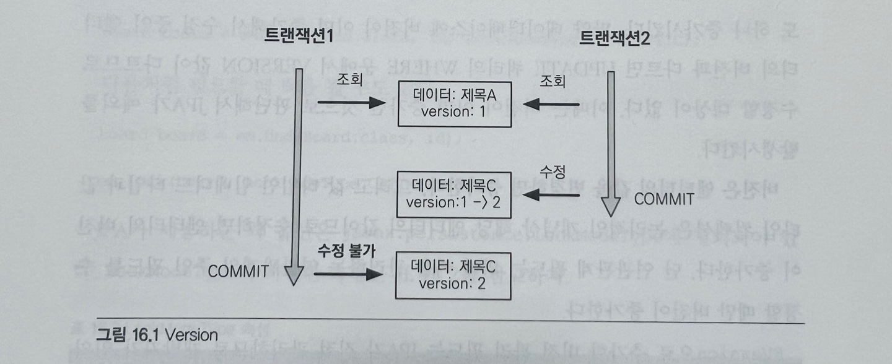

# 트랜잭션과 락, 2차 캐시

## 트랜잭션과 락

### 16.1.1 트랜잭션과 격리 수준
트랜잭션은 ACID라 하는 원자성, 일관성, 격리성, 지속성을 보장해야 한다.

* 원자성: 트랜잭션 내에서 실행한 작업들은 마치 하나의 작업인 것처럼 모두 성공하던가 실패해야 한다. <br>
ex) 계좌이체를 한다고 했을때 입금자가 성공하고 수신자 계좌에는 실패해서는 안된다. 이렇게 되면 입금자에 계좌에 돈만 사라지게 돼서 
큰 문제가 발생하게 된다. 따라서 하나의 트랜잭션 안에 작업들은 모두 성공하거나 실패해야 한다.

* 일관성 : 모든 트랜잭션은 일관성 있는 데이터베이스 상태를 유지해야 한다. <br>
ex) 데이터베이스에서 정한 무결성 제약 조건을 항상 만족해야 한다.

* 격리성 : 동시에 실행되는 트랜잭션들이 서로에게 영향을 미치지 않도록 격리한다. <br>
동시에 같은 데이터를 수정하지 못하도록 해야 한다. <br>
격리성은 동시성과 관련된 성능 이슈로 인해 격리 수준을 선택이 가능하다.

* 지속성: 트랜잭션을 성공적으로 끝내면 그 결과가 항상 기록(반영)되어야 한다. <br>
중간에 시스템에 문제가 발생해도 데이터베이스 로그 등을 사용해서 시스템 발생 전 상태로 되돌릴 수 있다. 

트랜잭션은 원자성, 일관성, 지속성을 보장한다. <br>
격리성을 완벽히 보장하려면 트랜잭션을 거의 차례대로 실행해야 한다. 이렇게 하면 동시성 처리 성능이 매우 나빠진다. <br>
이런 문제로 인해 트랜잭션의 격리 수준을 4단계로 나뉘어 정의했다.

* READ UNCOMMITED (커밋되지 않은 읽기)
* READ COMMITTED(커밋된 읽기)
* REPEATABLE READ(반복 가능한 읽기)
* SERIALIZABLE(직렬화 기능)

```
READ UNCOMMITED < READ COMMITTED < REPEATABLE READ < SERIALIZABLE 
동시성 🔺                                                   동시성 🔻 
격리성 🔻                                                   격리성 🔺
```

<table>
<tr>
    <th>격리수준</th>
    <th>DIRTY READ</th>
    <th>NON-REPEATABLE READ</th>
    <th>PHANTOM READ</th>
</tr>
<tr>
    <td>READ UNCOMMITED</td>
    <td>O</td>
    <td>O</td>
    <td>O</td>
</tr>
<tr>
    <td>READ COMMITED</td>
    <td></td>
    <td>O</td>
    <td>O</td>
</tr>
<tr>
    <td>REPEATABLE READ</td>
    <td></td>
    <td></td>
    <td>O</td>
</tr>
<tr>
    <td>SERIALIZABLE</td>
    <td></td>
    <td></td>
    <td></td>
</tr>
</table> 

```표 트랜잭션 격리 수준과 문제점 ```

격리 수준에 따른 문제점은 다음과 같다.
* DIRTY READ
* NON-REPEATABLE READ(반복 불가능한 읽기)
* PHANTOM READ

격리 수준이 낮을수록 더 많은 문제를 발생한다.

#### READ UNCOMMITED 
커밋하지 않은 데이터를 읽을 수 있다. <br>
ex) 트랜잭션 1이 회원테이블에 A의 나이를 20살에서 21살로 update 작업을 수행하고 커밋하지 않아도 
트랜잭션 2가 A의 나이를 조회할 경우 21살로 조회가 된다. 이러한 문제를 ```DIRTY READ```라고 한다. <br>
만약 트랜잭션 1이 문제가 발생해 롤백하게 되면 A의 나이는 20살로 변경되고 트랜잭션 2는 계속 21살로 인지하고 있다. <br>
이렇게 되면 데이터 정합성 문제가 심각하게 발생한다. 

#### READ COMMITTED 
커밋한 데이터만 읽을 수 있다. <br>
커밋한 데이터만 읽을 수 있기 때문에 DIRTY READ가 발생하지 않지만 NON-REPEATABLE READ는 발생할 수 있다. <br>
ex) 트랜잭션 1이 A의 나이를 조회하면 20살이 조회중에 트랜잭션 2가 A의 나이를 21살로 변경하고 커밋을 하게되면
트랜잭션 1이 A의 나이를 다시 조회하면 수정된 나이 21살이 조회된다. <br>
이처럼 반복해서 같은 데이터를 읽을 수 없는 상태를 NON-REPEATABLE READ 라고 한다. 

#### REPEATABLE READ
한 번 조회한 데이터를 반복해서 조회해도 같은 데이터가 조회된다. 하지만 PHANTOM READ는 발생할 수 있다. <br>


#### SERIALIZABLE
가장 엄격한 트랜잭션 격리 수준이다. <br>
격리수준이 SERIALIZABLE일 경우 읽기 작업에도 ```공유 잠금```을 설정하게 되고, 이러면 동시에 다른 트랜잭션에서 해당 레코드를
변경하지 못하게 되기때문에 동시성 처리 성능이 급격히 떨어진다.


### 16.1.2 낙관적 락과 비관적 락 기초

JPA의 영속성 컨텍스트(1차캐시)를 적절히 활용하면 데이터베이스 트랜잭션이 READ COMMITED 격리 수준이어도 애플리케이션 레벨에서
반복 가능한 읽기가 가능하기 때문에 트랜잭션 격리 수준을 READ COMMITED 정도로 가정한다. <br>
만약 일부 로직에 더 높은 격리 수준이 필요하면 낙관적 락과 비관적 락 중 하나를 사용해야 한다.

##### 낙관적 락
트랜잭션 대부분 충돌이 발생하지 않는다고 낙관적으로 가정하는 방법이다. <br>
데이터베이스가 제공하는 락 기능을 사용하는 것이 아니라 JPA가 제공하는 버전 관리 기능을 사용하는 애플리케이션이 제공하는 락이다. <br>
낙관적 락은 트랜잭션을 커밋하기 전까지는 트랜잭션의 충돌을 알 수 없다는 특징이 있다.

##### 비관적 락
트랜잭션의 충돌이 발생한다고 가정하고 우선 락을 걸고 보는 방법이다. <br>
데이터베이스가 제공하는 락 기능을 사용하며 대표적으로 ```select for update``` 구문이 있다. <br>
추가로 데이터베이스 트랜잭션 범위를 넘어서는 문제도 있다. 예를들어 동시에 사용자 A,B가 같은 공지사항을 수정한다고 가정할때
수정 화면에서 수정 후 A가 먼저 완료 버튼을 누르고 잠시 뒤 B가 완료 버튼을 눌렀을때 A가 수정한 수정내역은 없고 B가 수정한
내역이 남게 된다. 이것을 ```두 번의 갱신 분실 문제```라 한다.

이 문제는 트랜잭션 범위를 넘어서기 때문에 트랜잭션만으로 해결을 할 수 없으며 3가지 방법중 하나로 선택해야 한다. 
* 마지막 커밋만 인정하기 : 사용자 A의 내용은 무시하고 마지막에 커밋한 사용자 B의 내용만 인정한다.
* 최초 커밋만 인정하기 : 사용자 A가 이미 수정을 완료했으므로 사용자 B가 수정을 완료할 때 오류가 발생한다.
* 충돌하는 갱신 내용 병합하기 : 사용자 A와 사용자 B의 수정사항을 병합한다.
 
기본은 마지막 커밋만 인정하기가 사용된다. 하지만 상황에 따라 최초 커밋만 인정하기가 더 합리적일 수 있다. <br>
JPA가 제공하는 버전 관리 기능을 사용하면 손쉽게 최초 커밋만 인정하기를 구현이 가능하다.
충돌하는 갱신 내용 병합하기는 최초 커밋만 인정하기를 좀 더 우아하게 처리하는 방법인데 개발자가 직접 사용자를 위해 병합 방법을
제공해야 한다.

### 16.1.3 @Version
JPA가 제공하는 낙관적 락을 사용하려면 @Version 어노테이션을 사용해서 버전 관리 기능을 추가해야 한다.
```java
@Entity
public class Board {
    
    @Id
    private String id;
    private String title;
    
    @Version
    private Integer version;
}
```
버전 관리 기능을 적용하려면 엔티티에 버전 관리용 필드를 하나 추가하고 @Version 어노테이션을 붙이면 된다. <br>
엔티티를 수정할 때 마다 버전이 하나씩 자동으로 증가하고 엔티티를 수정할 때 조회 시점의 버전과 수정 시점의 버전이 다르면 예외가 발생한다.

```
// 트랜잭션 1 조회 title="제목A", version=1
Board board = em.find(Board.class, id);

// 트랜잭션 2에서 해당 게시물을 수정해서 title="제목C", version=2로 증가

board.setTitle("제목B");  // 트랜잭션1 데이터 수정

save(board);
tx.commit();        // 예외 발생, 데이터베이스 version=2, 엔티티 version=1 
```

제목이 A이고 버전이 1인 게시물이 있다.
1. 트랜잭션 1은 제목 B로 변경하려고 조회하려고 한다.
2. 이때 트랜잭션 2가 해당 데이터를 조회해서 제목 C로 수정하고 커밋해서 버전 정보가 2로 증가했다.
3. 이후 트랜잭션 1이 데이터를 제목 B로 변경하고 트랜잭션 커밋하는 순간 엔티티를 조회할 때 버전과 데이터베이스의 현재 버전
정보가 다르므로 예외가 발생한다.
4. 따라서 버전 정보를 사용하면 ```최초 커밋만 인정하기```가 적용된다.

#### 버전 정보 비교 방법
JPA가 버전 정보를 비교하는 방법은 단순하며 엔티티를 수정하고 트랜잭션 커밋하면 영속성 컨텍스트를 플러시 하면서
UPDATE 쿼리를 실행한다.
```
UPDATE BOARD
SET
    TITLE = ?,
    VERSION = ? (버전 + 1 증가)
WHERE
    ID = ?
    AND VERSION = ? (버전 비교)
```
데이터베이스 버전과 엔티티 버전이 같으면 데이터를 수정하면서 동시에 버전도 하나 증가시킨다. <br>
만약 데이터베이스에 버전이 이미 증가해서 수정 중인 엔티티의 버전과 다르면 UPDATE 쿼리의 WHERE 문에서 VERSION 값이 다르므로
수정할 대상이 없다. 이때 버전이 이미 증가한 것으로 판단해서 JPA가 예외를 발생시킨다.
버전은 엔티티의 값을 변경하면 증가한다. 단 연관관계 필드는 외래 키를 관리하는 연간관계의 주인 필드를 수정할 때만 버전이 증가한다.
@Version으로 추가한 버전 관리 필드는 JPA가 직접 관리하므로 개발자가 임의로 수정하면 안된다.(벌크 연산 제외)

### 16.1.4 JPA 락 사용
```
JPA를 사용할 때 추천하는 전략은 READ COMMITED 트랜잭션 격리 수준 + 낙관적 버전 관리(@Version)이다.
```
락 적용
* EntityManager.lock(), EntityManager.find(), EntityManager.refresh()
* Query.setLockMode() (TypeQuery 포함)
* @NamedQuery

<table>
<tr>
    <th>락 모드</th>
    <th>타입</th>
    <th>설명</th>
</tr>
<tr>
    <td>낙관적 락</td>
    <td>OPTIMISTIC</td>
    <td>낙관적 락을 사용한다.</td>
</tr>
<tr>
    <td>낙관적 락</td>
    <td>OPTIMISTIC_FORCE_INCREMENT</td>
    <td>낙관적 락 + 버전정보를 강제로 증가한다.</td>
</tr>
<tr>
    <td>비관적 락</td>
    <td>PESSIMISTIC_READ</td>
    <td>비관적 락, 읽기 락을 사용한다.</td>
</tr>
<tr>
    <td>비관적 락</td>
    <td>PESSIMISTIC_WRITE</td>
    <td>비관적 락, 쓰기 락을 사용한다.</td>
</tr>
<tr>
    <td>비관적 락</td>
    <td>PESSIMISTIC_FORCE_INCREMENT</td>
    <td>비관적 락 + 버전정보를 강제로 증가한다.</td>
</tr>
<tr>
    <td>기타</td>
    <td>NONE</td>
    <td>락을 걸지 않는다.</td>
</tr>
<tr>
    <td>기타</td>
    <td>READ</td>
    <td>JPA 1.0 호환 기능이다. OPTIMISTIC과 같으므로 OPTIMISTIC을 사용하면 된다.</td>
</tr>
<tr>
    <td>기타</td>
    <td>WRITE</td>
    <td>JPA 1.0 호환 기능이다. OPTIMISTIC_FORCE_INCREMENT와 같다.</td>
</tr>
</table>

